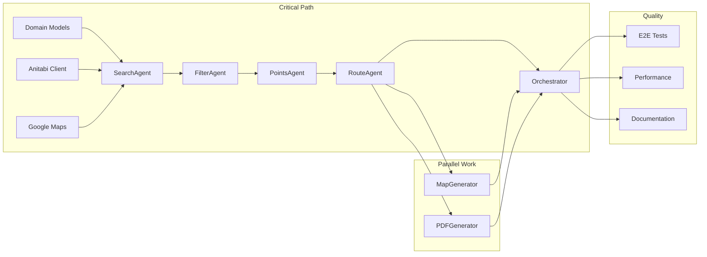

# 🚀 Seichijunrei Bot - Sprint Plan & Tracking Dashboard

**Sprint Name**: Seichijunrei MVP Development Sprint
**Sprint Duration**: 3 Days (2025-11-20 to 2025-11-22)
**Total Story Points**: 120
**Team Size**: 3 Parallel Agents
**Sprint Goal**: Deliver MVP with core features for Google ADK Capstone

---

## 📊 Sprint Overview Dashboard

| Metric | Target | Current | Status |
|--------|--------|---------|--------|
| Total Tasks | 36 | 0 | 🔴 Not Started |
| Story Points | 120 | 0 | 🔴 Not Started |
| Test Coverage | >80% | 0% | 🔴 Not Started |
| API Integration | 2 | 0 | 🔴 Not Started |
| Documentation | 100% | 10% | 🟡 In Progress |

---

## 👥 Team Allocation

| Agent | Role | Focus Areas | Story Points | Task Count |
|-------|------|-------------|--------------|------------|
| **Agent A** | Architecture Lead | Core Infrastructure, Agents, Integration | 42 | 12 |
| **Agent B** | API Specialist | External APIs, Data Services, Performance | 40 | 12 |
| **Agent C** | Tools Expert | Tools, Testing, Documentation, DevOps | 38 | 12 |

---

## 📅 Sprint Timeline

### Day 1 (Wednesday, Nov 20) - Foundation Phase
```
08:00-12:00 (4h) - Morning Session
├── Agent A: TASK-001, TASK-002, TASK-003
├── Agent B: TASK-013, TASK-014
└── Agent C: TASK-025, TASK-026

[SYNC POINT 1] 12:00 - API Design Review

13:00-17:00 (4h) - Afternoon Session
├── Agent A: TASK-004, TASK-005
├── Agent B: TASK-015, TASK-016
└── Agent C: TASK-027, TASK-028

[SYNC POINT 2] 17:00 - Component Integration Check
```

### Day 2 (Thursday, Nov 21) - Build Phase
```
08:00-12:00 (4h) - Morning Session
├── Agent A: TASK-006, TASK-007
├── Agent B: TASK-017, TASK-018
└── Agent C: TASK-029, TASK-030

[SYNC POINT 3] 12:00 - Mid-Sprint Review

13:00-17:00 (4h) - Afternoon Session
├── Agent A: TASK-008, TASK-009
├── Agent B: TASK-019, TASK-020
└── Agent C: TASK-031, TASK-032

[SYNC POINT 4] 17:00 - Integration Testing
```

### Day 3 (Friday, Nov 22) - Polish Phase
```
08:00-12:00 (4h) - Morning Session
├── Agent A: TASK-010, TASK-011
├── Agent B: TASK-021, TASK-022
└── Agent C: TASK-033, TASK-034

[SYNC POINT 5] 12:00 - Final Integration

13:00-15:00 (2h) - Final Session
├── Agent A: TASK-012
├── Agent B: TASK-023, TASK-024
└── Agent C: TASK-035, TASK-036

[DELIVERY] 15:00 - Sprint Demo & Retrospective
```

---

## 🔄 Task Dependencies Map



---

## 📋 Task Breakdown Summary

### Priority Levels
- **P0**: Blocker - Must complete for any progress
- **P1**: Critical - Core functionality
- **P2**: Important - Key features
- **P3**: Nice-to-have - Enhancements

### Task Status Legend
- 🔴 **Not Started**
- 🟡 **In Progress**
- 🟢 **Completed**
- 🔵 **Blocked**
- ⚫ **Cancelled**

---

## 📊 Daily Progress Tracking

### Day 1 Progress (Nov 20)
| Time | Agent A | Agent B | Agent C | Blockers |
|------|---------|---------|---------|----------|
| 09:00 | 🔴 TASK-001 | 🔴 TASK-013 | 🔴 TASK-025 | None |
| 10:00 | - | - | - | - |
| 11:00 | - | - | - | - |
| 12:00 | **SYNC 1** | **SYNC 1** | **SYNC 1** | - |
| 13:00 | 🔴 TASK-004 | 🔴 TASK-015 | 🔴 TASK-027 | - |
| 14:00 | - | - | - | - |
| 15:00 | - | - | - | - |
| 16:00 | - | - | - | - |
| 17:00 | **SYNC 2** | **SYNC 2** | **SYNC 2** | - |

### Day 2 Progress (Nov 21)
| Time | Agent A | Agent B | Agent C | Blockers |
|------|---------|---------|---------|----------|
| 09:00 | 🔴 TASK-006 | 🔴 TASK-017 | 🔴 TASK-029 | - |
| ... | ... | ... | ... | ... |

### Day 3 Progress (Nov 22)
| Time | Agent A | Agent B | Agent C | Blockers |
|------|---------|---------|---------|----------|
| 09:00 | 🔴 TASK-010 | 🔴 TASK-021 | 🔴 TASK-033 | - |
| ... | ... | ... | ... | ... |

---

## 🚨 Risk Register

| Risk ID | Description | Probability | Impact | Mitigation | Owner |
|---------|-------------|------------|--------|------------|-------|
| R001 | Anitabi API rate limiting | High | Medium | Implement caching, use mock data | Agent B |
| R002 | Google Maps quota exceeded | Low | High | Monitor usage, have backup API key | Agent C |
| R003 | >23 waypoints routing | High | Medium | Implement chunking algorithm | Agent A |
| R004 | PDF generation timeout | Medium | Low | Async generation, image compression | Agent C |
| R005 | Integration delays | Medium | High | Daily sync points, clear interfaces | All |
| R006 | Test data unavailability | Low | Medium | Create comprehensive mock data | Agent B |

---

## ✅ Definition of Done (Sprint Level)

### Code Quality
- [ ] All tasks completed and marked green
- [ ] Code review completed for all PRs
- [ ] No critical bugs remaining
- [ ] Performance targets met (<30s response time)

### Testing
- [ ] Unit test coverage >80%
- [ ] Integration tests passing
- [ ] E2E test suite completed
- [ ] Manual testing checklist completed

### Documentation
- [ ] README.md updated
- [ ] API documentation generated
- [ ] Deployment guide written
- [ ] Demo video recorded

### Delivery
- [ ] All features working in production environment
- [ ] Meets ADK Capstone requirements (3+ key concepts)
- [ ] Submission package prepared
- [ ] Stakeholder sign-off received

---

## 🔄 Daily Standup Schedule

### Format
```
1. What did you complete yesterday?
2. What will you work on today?
3. Any blockers or dependencies?
4. Risk updates?
```

### Schedule
- **Day 1**: 08:00 (Kickoff), 12:00 (Sync 1), 17:00 (Sync 2)
- **Day 2**: 08:00 (Standup), 12:00 (Sync 3), 17:00 (Sync 4)
- **Day 3**: 08:00 (Standup), 12:00 (Sync 5), 15:00 (Demo)

---

## 📈 Velocity Metrics

| Metric | Day 1 Target | Day 1 Actual | Day 2 Target | Day 2 Actual | Day 3 Target | Day 3 Actual |
|--------|--------------|--------------|--------------|--------------|--------------|--------------|
| Tasks Completed | 15 | - | 15 | - | 6 | - |
| Story Points | 50 | - | 50 | - | 20 | - |
| Test Coverage | 30% | - | 60% | - | 85% | - |
| Integration Points | 2 | - | 5 | - | 8 | - |

---

## 🎯 Sprint Goals & Success Criteria

### Must Have (P0-P1)
1. ✅ Core domain models implemented
2. ✅ Anitabi API integration working
3. ✅ Google Maps geocoding functional
4. ✅ Basic route generation
5. ✅ SearchAgent operational

### Should Have (P2)
1. ✅ All agents integrated
2. ✅ Map visualization working
3. ✅ PDF generation functional
4. ✅ Error handling robust

### Nice to Have (P3)
1. ✅ Performance optimized
2. ✅ Comprehensive logging
3. ✅ Full test coverage
4. ✅ Deployment automated

---

## 🏁 Sprint Retrospective (To be filled Day 3)

### What Went Well
- [ ] TBD

### What Could Be Improved
- [ ] TBD

### Action Items for Next Sprint
- [ ] TBD

---

## 📞 Communication Channels

- **Primary**: Sprint tracking in this file
- **Blockers**: Update risk register immediately
- **Code**: GitHub/GitLab PR reviews
- **Documentation**: Inline comments + README
- **Demo**: Recorded video for stakeholders

---

## 🔗 Quick Links

- [Agent A Tasks](./SPRINT_AGENT_A.md)
- [Agent B Tasks](./SPRINT_AGENT_B.md)
- [Agent C Tasks](./SPRINT_AGENT_C.md)
- [Technical Specification](./SPEC.md)
- [User Stories](./Claude-Context/user-stories.md)
- [API Documentation](./docs/)

---

**Last Updated**: 2025-11-20 09:00 CST
**Next Update**: 2025-11-20 12:00 CST (Sync Point 1)