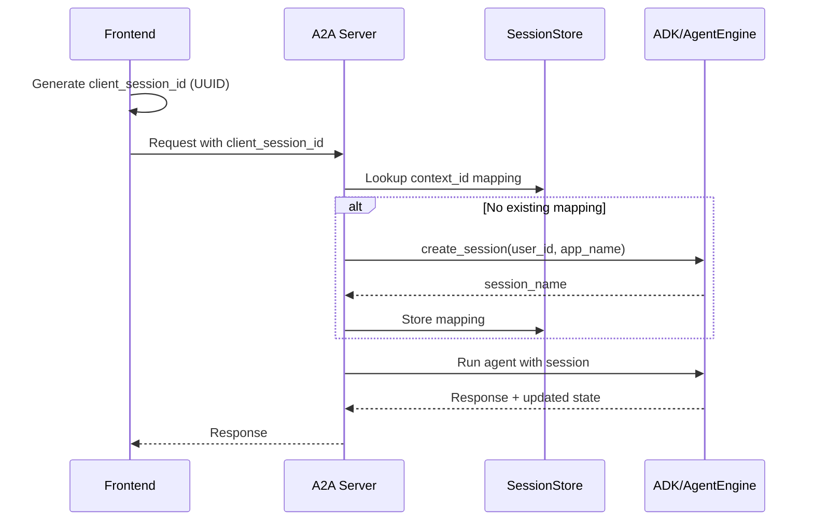

# A2UI Session Model

> A2UI-002: Mapping A2A task_id/context_id to ADK session_id/user_id

## Overview

This document defines how session identifiers map between the three layers:
1. **Frontend** (browser/client)
2. **A2A Protocol** (Agent-to-Agent)
3. **ADK Runtime** (Agent Development Kit)

## Identifier Definitions

| Layer | Identifier | Description | Lifecycle |
|-------|------------|-------------|-----------|
| Frontend | `client_session_id` | Browser-generated UUID stored in localStorage | Per browser session |
| A2A | `context_id` | Conversation context identifier | Per conversation |
| A2A | `task_id` | Single request identifier | Per request |
| ADK | `session.id` | ADK session identifier | Per conversation |
| ADK | `session.user_id` | User identifier for state isolation | Per user |
| ADK | `session.app_name` | Application identifier | Fixed per deployment |

## Mapping Strategy

### Mode 1: Local Development (InMemorySessionService)

```
Frontend                 A2UI Server              ADK
─────────────────────────────────────────────────────────
client_session_id ───┬─► context_id ───────────► session.id
                     │
                     └─► (derived) ────────────► session.user_id = "a2ui-web"
                     
                         task_id ──────────────► (ignored, per-request only)
                         
                         app_name ─────────────► session.app_name = "seichijunrei_bot"
```

### Mode 2: Agent Engine (Production)

```
Frontend                 A2A Server              Agent Engine
─────────────────────────────────────────────────────────────
client_session_id ───┬─► context_id ───────────► remote_session_name
                     │                           (created via AgentEngine.create_session)
                     │
                     └─► user_id (from auth) ──► session.user_id
                     
                         task_id ──────────────► request correlation only
```

## Implementation Details

### Session Creation Flow



### State Isolation

Sessions are isolated by the combination of:
- `session.id` - Unique per conversation
- `session.user_id` - Unique per user (enables multi-user support)
- `session.app_name` - Fixed per application

### ID Generation Rules

| Identifier | Generator | Format | Persistence |
|------------|-----------|--------|-------------|
| `client_session_id` | Frontend | UUIDv4 | localStorage |
| `context_id` | A2A Server | `ctx_{client_session_id}` | In-memory + Redis (future) |
| `task_id` | A2A Server | `task_{timestamp}_{random}` | Request-scoped |
| `session.id` | ADK | Auto-generated or passed | SessionService |
| `session.user_id` | Config/Auth | From config or JWT | N/A |

## Session State Management

### State Shape

All session state follows the schema defined in `adk_agents/seichijunrei_bot/_state.py`:

```python
# Key state fields
BANGUMI_CANDIDATES = "bangumi_candidates"  # List of anime candidates
SELECTED_CANDIDATE_IDX = "selected_candidate_idx"  # User's selection
ROUTE_POINTS = "route_points"  # Planned route points
USER_LANGUAGE = "user_language"  # Detected language
```

### State Persistence Strategies

| Environment | Strategy | Implementation |
|-------------|----------|----------------|
| Local dev | In-memory dict | `LocalBackend._states` |
| Local + persistence | File-based | Future: JSON files per session |
| Agent Engine | Remote state | `AgentEngine.session_state` |
| Production + Redis | Distributed cache | Future: Redis adapter |

## A2A Protocol Integration

### Request Structure

```json
{
  "jsonrpc": "2.0",
  "method": "tasks/send",
  "params": {
    "id": "task_1706123456789_abc123",
    "message": {
      "role": "user",
      "parts": [{"text": "京都でSAOの聖地を教えて"}]
    },
    "contextId": "ctx_550e8400-e29b-41d4-a716-446655440000"
  }
}
```

### Mapping in A2A Handler

```python
async def handle_task(request: A2ATaskRequest) -> A2ATaskResponse:
    # Extract identifiers
    task_id = request.params.id
    context_id = request.params.context_id
    
    # Map to ADK session
    session = await session_store.get_or_create(
        context_id=context_id,
        user_id=get_user_id_from_auth(request),
        app_name="seichijunrei_bot"
    )
    
    # Run agent
    result = await runner.run_async(
        agent=root_agent,
        session=session,
        user_content=request.params.message
    )
    
    return A2ATaskResponse(
        id=task_id,
        contextId=context_id,
        status="completed",
        result=result
    )
```

## Migration Path

### Phase 1: MVP (Current)
- `client_session_id` → `session.id` direct mapping
- Fixed `user_id` from config
- In-memory state storage

### Phase 2: Multi-user Support
- JWT-based `user_id` extraction
- Per-user state isolation
- Session timeout handling

### Phase 3: Distributed
- Redis-backed session store
- Cross-instance session sharing
- Session migration support

## Security Considerations

1. **Session Hijacking**: Use signed session tokens in production
2. **State Isolation**: Never expose one user's state to another
3. **Cleanup**: Implement session expiration and cleanup
4. **Rate Limiting**: Per-session rate limits to prevent abuse

## Session Adapter Pattern

The session adapter pattern provides a clean abstraction for mapping between A2A and ADK sessions.

### Interface

```python
class SessionAdapter(ABC):
    """Abstract session adapter interface."""

    @abstractmethod
    async def get_or_create_session(
        self,
        *,
        context_id: str,
        user_id: str,
        app_name: str,
    ) -> tuple[SessionInfo, Session]:
        """Get or create both A2UI session info and ADK session."""
        ...

    @abstractmethod
    async def sync_state_to_store(
        self,
        context_id: str,
        state: dict[str, Any],
    ) -> None:
        """Sync ADK session state to the session store."""
        ...

    @abstractmethod
    async def get_state(self, context_id: str) -> dict[str, Any]:
        """Get the current state for a context."""
        ...
```

### Implementations

| Adapter | Use Case | State Storage |
|---------|----------|---------------|
| `InMemorySessionAdapter` | Local development | In-memory dict |
| `RedisSessionAdapter` | Production (future) | Redis |
| `FirestoreSessionAdapter` | GCP production (future) | Firestore |

### Usage in A2A Server

```python
from interfaces.a2a_server import InMemorySessionAdapter

adapter = InMemorySessionAdapter()

# Get or create session
session_info, adk_session = await adapter.get_or_create_session(
    context_id=context_id,
    user_id="a2a-client",
    app_name="seichijunrei_bot",
)

# Run agent with ADK session
# ...

# Sync state back to store
await adapter.sync_state_to_store(context_id, adk_session.state)
```

## Related Documents

- [A2UI Contracts](CONTRACT.md) - Message format definitions
- [Actions Reference](ACTIONS.md) - User action definitions
- `contracts/a2ui/session.py` - Session store interface
- `interfaces/a2a_server/session.py` - Session adapter implementation
- `adk_agents/seichijunrei_bot/_state.py` - State key definitions
