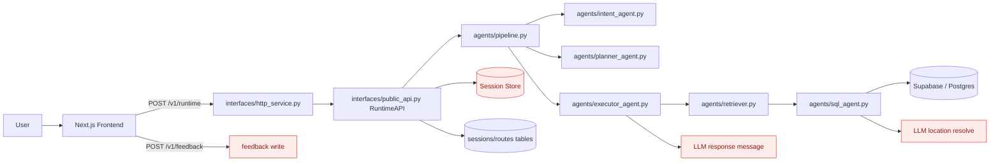
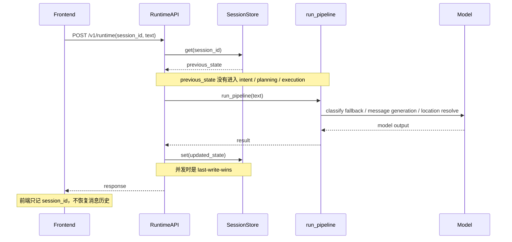

# 稳定性 Review

日期：2026-03-24

## 结论

当前代码的核心链路并不算“乱”，主干也比较清晰：

`Frontend -> HTTP Service -> RuntimeAPI -> Intent -> Planner -> Executor -> Retriever/SQL`

但系统的“不稳定感”主要来自边缘层，而不是主干本身：

- 对外响应文案仍然依赖 LLM，导致同一输入可能返回不同文本
- 会话看起来是“有状态”的，但业务执行实际上仍是单轮无记忆
- 错误语义在接口层被压扁，很多用户问题会被伪装成 500
- 前端的反馈、认证、i18n、构建路径还有几处契约没收口

## 当前业务流

## 主要问题

### 1. 用户可见输出并不稳定，且“确定性架构”被 LLM 边缘逻辑打穿

证据：

- `uv run pytest` 在 `tests/integration/test_runtime_acceptance.py` 失败。
- 失败点是同一输入分别经过 `run_pipeline()` 和 `handle_public_request()` 后，`message` 不一致。
- 实际报错：
  - `このアニメの聖地は見つかりませんでした。`
  - `その作品の聖地は見つかりませんでした。`

根因：

- `agents/executor_agent.py:224-229` 每次格式化响应都会调用 `_build_response_message_llm()`
- `agents/executor_agent.py:404-430` 把最终用户文案交给 LLM 生成
- `agents/sql_agent.py:109-137` 连地名解析也会在精确匹配失败后走 LLM

影响：

- 同一请求重试时，前端文案、验收基线、埋点语义都可能漂移
- 响应时延、成本、失败模式被外部模型状态放大
- 当前文档里“deterministic plan-and-execute”的说法只对检索主干成立，不对用户可见输出成立

### 2. 错误语义被压扁成 `pipeline_error`，很多用户问题会被返回成 500

根因：

- `interfaces/public_api.py:281-302` 把所有 step error 都映射成 `pipeline_error`
- `interfaces/http_service.py:263-290` 又把 `pipeline_error` 统一映射成 HTTP 500

这意味着：

- 地点无法解析
- bangumi 参数缺失
- 路线点为空

这类更像 4xx 或业务空结果的问题，最后都会被接口层包装成服务端错误。

影响：

- 前端和调用方无法区分“用户输入问题”与“服务真的挂了”
- 监控里 500 会被放大，排障噪音很高
- 后续做重试、熔断、告警时策略会失真

### 3. 会话现在更像审计日志，不是真正参与业务的上下文

根因：

- `interfaces/public_api.py:107-147` 虽然先读取 `previous_state`，但 `run_pipeline()` 并没有接收任何 session/context
- `interfaces/public_api.py:143-165` 会话只在响应后被回写
- `frontend/hooks/useSession.ts:7-27` 只持久化 `session_id`
- `frontend/hooks/useChat.ts:17-18,81-83` 消息列表只存在内存里，刷新即丢
- `frontend/components/layout/AppShell.tsx:20-24` 侧边栏 route history 也是从当前内存消息里反推，不是从后端会话恢复

这说明当前“session-aware”实际语义是：

- 后端记录历史
- 前端保存一个 session_id
- 但运行时推理、检索、规划都不消费这些历史

影响：

- 用户发 follow-up 问题时，系统不会真正理解上下文
- 页面一刷新，UI 视角像“新会话”；后端视角又像“老会话”
- 这正是很典型的“感觉不稳定”

附带风险：

- `interfaces/public_api.py:107-162` 是典型的 `get -> modify -> set`
- 没有版本号、锁、append-only 语义，并发请求同一 `session_id` 时会有 last-write-wins 风险

### 4. 反馈链路存错了数据，评估闭环会被污染

根因：

- `frontend/components/chat/MessageBubble.tsx:70-75` 提交反馈时传的是 `query_text: message.text`
- 这里的 `message` 是 assistant bubble，不是 user bubble
- `infrastructure/supabase/client.py:320-340` 后端按 `query_text` 落库

影响：

- feedback 表里保存的不是“用户问了什么”，而是“系统答了什么”
- 后续你做 bad case 回放、偏好训练、eval 数据清洗时会直接串味

### 5. 前端认证 / 语言 / 构建路径还有环境耦合

几个次级问题：

- `frontend/components/auth/AuthGate.tsx:84-88` 登录回调写死到 `/auth/callback`
- 但仓库里同时存在 `frontend/app/auth/callback/route.ts:1-20` 和 `frontend/app/[lang]/auth/callback/route.ts:1-21`
- 当前登录路径不会保留用户选中的语言
- `frontend/app/page.tsx:1-4` 和 `frontend/app/[lang]/page.tsx:1-4` 逻辑重复，根路由和多语言树没有彻底收口
- `npm run build` 在当前环境失败，原因是 `next/font/google` 需要联网拉 `Geist / Geist Mono`

影响：

- 认证回跳语言可能漂移
- 本地/CI/受限网络环境下构建不稳定

## 为什么你会“总感觉很不稳定”

一句话概括：

核心检索链路偏确定性，但会话层、呈现层、反馈层都带着“像有状态、其实不闭环”的特征，所以体验上会显得忽好忽坏。

## 建议的收敛顺序

### 第一优先级

1. 把用户文案从“每次都调 LLM”改成“默认模板化，LLM 只做可选 embellishment”
2. 给公共 API 建立真正的错误 taxonomy
3. 明确 session 的产品语义

建议二选一：

- 要么把历史真正送进 intent/planner/executor
- 要么承认它只是 trace/history，不要再把它包装成“对话记忆”

### 第二优先级

1. 修正 feedback payload，保证提交的是原始用户 query 或 request_id
2. 给 session 持久化加版本号 / CAS / append-only 语义
3. 统一 auth callback 到带 locale 的单一路径

### 第三优先级

1. 去掉构建时对 Google Fonts 在线拉取的硬依赖
2. 补前端集成测试，特别是 auth + locale + chat feedback
3. 给“同一输入输出应稳定”的路径补 snapshot / golden tests

## 验证记录

- `uv run pytest`
  - 失败：`tests/integration/test_runtime_acceptance.py::test_runtime_acceptance_baseline[bangumi_search_empty]`
  - 说明同一输入的 `message` 不稳定
- `npm run lint`
  - 通过，但有 1 个 warning：`frontend/components/layout/AppShell.tsx:17` 的 `setPrefill` 未使用
- `npm run build`
  - 当前环境下失败，原因是 Google Fonts 联网拉取失败
