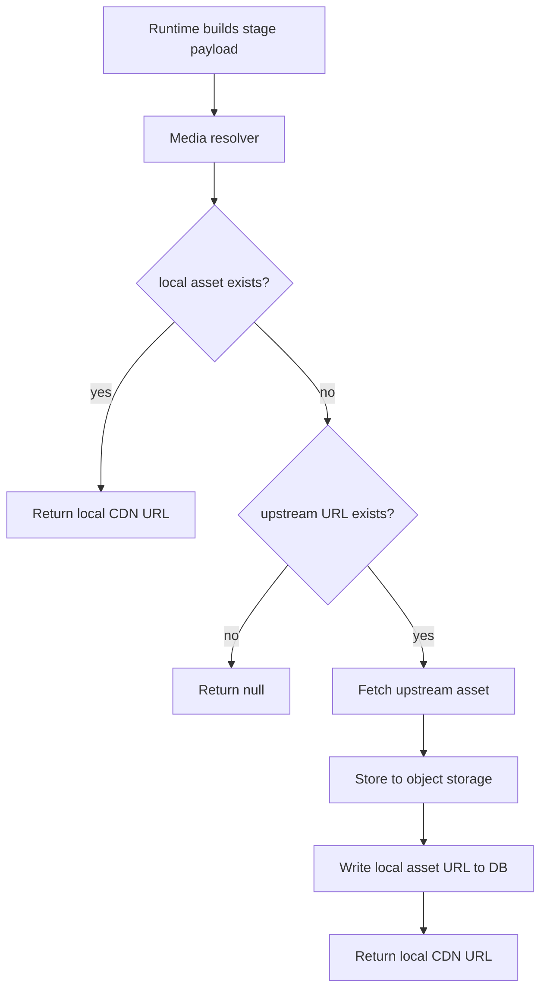
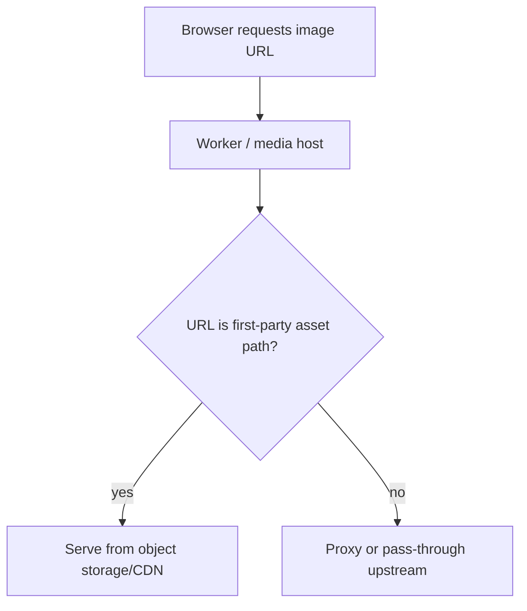

# Media Ownership Fallback Implementation Plan

> **For agentic workers:** REQUIRED SUB-SKILL: Use superpowers:subagent-driven-development (recommended) or superpowers:executing-plans to implement this plan task-by-task. Steps use checkbox (`- [ ]`) syntax for tracking.

**Goal:** Add a Phase 2 media fallback pipeline so anime covers and point screenshots prefer first-party object storage/CDN URLs and fall back to upstream URLs, with DB write-through and stable backend-owned media contract.

**Architecture:** Keep frontend image fields simple (`cover_url`, `screenshot_url`) while moving media ownership logic behind the backend. Store both upstream and local asset URLs, resolve local first, fetch/store on miss, then write-through so future requests serve our own CDN path.

**Tech Stack:** Supabase/Postgres, Cloudflare Worker, Cloudflare R2 (or equivalent object storage), backend Python media service, pytest, integration tests, API contract tests.

---

## File Structure

### New files
- `backend/media/models.py` — typed media asset models and resolver output
- `backend/media/storage.py` — object storage interface / R2 adapter wrapper
- `backend/media/service.py` — media fallback resolution and write-through logic
- `backend/tests/unit/test_media_service.py` — unit tests for media fallback logic
- `backend/tests/integration/test_media_contract.py` — API-level integration tests for media ownership contract
- `backend/tests/eval/datasets/media_contract_v1.json` — optional eval-style dataset for media contract assertions if we decide to keep media checks in eval infra

### Existing files to modify
- `backend/infrastructure/supabase/repositories/bangumi.py` — read/write local/upstream cover URL fields
- `backend/infrastructure/supabase/repositories/points.py` — read/write local/upstream screenshot URL fields
- `backend/interfaces/response_builder.py` — always emit resolved public media URLs
- `backend/agents/tools.py` or equivalent runtime data shapers — use media resolver before returning payloads
- `worker/worker.js` — support first-party asset serving path if needed
- `supabase/migrations/*.sql` — add local/upstream media columns
- `backend/tests/unit/repositories/test_bangumi_repo.py`
- `backend/tests/unit/repositories/test_points_repo.py`

---

## API Behavior and Request Chains

### Runtime stage payloads

**Expected behavior:**
- Frontend receives `cover_url` and `screenshot_url` as final resolved public URLs.
- Frontend does not reconstruct URLs from `bangumi_id`.
- Frontend does not need to know whether the URL came from:
  - local object storage/CDN
  - Worker proxy path
  - raw upstream fallback

**Chain:**


### Worker media path

**Expected behavior:**
- Worker serves first-party media path if local asset exists.
- Optional fallback to upstream proxy path remains possible during migration.

**Chain:**


---

## Task 1: Lock media contract with tests first

**Files:**
- Create: `backend/tests/integration/test_media_contract.py`
- Modify: `backend/tests/integration/test_api_contract.py`
- Modify: `backend/tests/unit/repositories/test_bangumi_repo.py`
- Modify: `backend/tests/unit/repositories/test_points_repo.py`

- [ ] **Step 1: Write the failing media contract tests**

```python
def test_route_payload_returns_cover_url_as_final_public_url(client):
    response = client.post("/v1/runtime", json={"text": "帮我规划吹响上低音号的巡礼路线", "locale": "zh"})
    payload = response.json()
    assert payload["data"]["route"]["cover_url"].startswith("http")
    assert "image.anitabi.cn/bangumi/" not in payload["data"]["route"]["cover_url"]


def test_point_rows_return_screenshot_url_as_final_public_url(client):
    response = client.post("/v1/runtime", json={"text": "宇治站附近有什么圣地？", "locale": "zh"})
    payload = response.json()
    row = payload["data"]["results"]["rows"][0]
    assert row["screenshot_url"] is None or row["screenshot_url"].startswith("http")
```
```

- [ ] **Step 2: Run tests to verify they fail**

Run: `uv run pytest backend/tests/integration/test_media_contract.py -v --no-cov`
Expected: FAIL because media resolution logic and DB fields do not exist yet.

- [ ] **Step 3: Add repository-level failing tests for local/upstream precedence**

```python
async def test_bangumi_repo_prefers_local_cover_url(repo) -> None:
    row = await repo.get_bangumi("123")
    assert row["cover_url_local"] == "https://cdn.example/bangumi/123.jpg"


async def test_points_repo_prefers_local_screenshot_url(repo) -> None:
    rows = await repo.get_points_by_bangumi("123")
    assert rows[0]["image_local"].startswith("https://cdn.example/")
```
```

- [ ] **Step 4: Run repository tests**

Run: `uv run pytest backend/tests/unit/repositories/test_bangumi_repo.py backend/tests/unit/repositories/test_points_repo.py -v --no-cov`
Expected: FAIL.

- [ ] **Step 5: Commit**

```bash
git add backend/tests/integration/test_media_contract.py backend/tests/integration/test_api_contract.py backend/tests/unit/repositories/test_bangumi_repo.py backend/tests/unit/repositories/test_points_repo.py
git commit -m "test: add media ownership contract coverage"
```

---

## Task 2: Add DB columns for local/upstream media ownership

**Files:**
- Create: `supabase/migrations/20260423xxxxxx_media_asset_urls.sql`
- Test: `backend/tests/unit/test_migration_runner.py`

- [ ] **Step 1: Write the failing migration test**

```python
def test_media_asset_columns_exist_after_migration(pg_conn):
    columns = list_columns(pg_conn, "bangumi")
    assert "cover_url_upstream" in columns
    assert "cover_url_local" in columns

    point_columns = list_columns(pg_conn, "points")
    assert "image_upstream" in point_columns
    assert "image_local" in point_columns
```

- [ ] **Step 2: Run migration test to verify it fails**

Run: `uv run pytest backend/tests/unit/test_migration_runner.py -v --no-cov`
Expected: FAIL because the new migration has not been created.

- [ ] **Step 3: Write the migration**

```sql
ALTER TABLE bangumi
  ADD COLUMN IF NOT EXISTS cover_url_upstream TEXT,
  ADD COLUMN IF NOT EXISTS cover_url_local TEXT;

UPDATE bangumi
SET cover_url_upstream = COALESCE(cover_url_upstream, cover_url)
WHERE cover_url IS NOT NULL;

ALTER TABLE points
  ADD COLUMN IF NOT EXISTS image_upstream TEXT,
  ADD COLUMN IF NOT EXISTS image_local TEXT;

UPDATE points
SET image_upstream = COALESCE(image_upstream, image)
WHERE image IS NOT NULL;
```

- [ ] **Step 4: Run migration tests**

Run: `uv run pytest backend/tests/unit/test_migration_runner.py -v --no-cov`
Expected: PASS.

- [ ] **Step 5: Commit**

```bash
git add supabase/migrations backend/tests/unit/test_migration_runner.py
git commit -m "feat: add local and upstream media URL columns"
```

---

## Task 3: Build media resolver service

**Files:**
- Create: `backend/media/models.py`
- Create: `backend/media/storage.py`
- Create: `backend/media/service.py`
- Test: `backend/tests/unit/test_media_service.py`

- [ ] **Step 1: Write the failing media service tests**

```python
async def test_media_service_prefers_local_url(storage, db) -> None:
    service = MediaService(storage=storage, db=db)
    result = await service.resolve_cover(
        bangumi_id="123",
        local_url="https://cdn.example/b/123.jpg",
        upstream_url="https://image.anitabi.cn/b/123.jpg",
    )
    assert result.public_url == "https://cdn.example/b/123.jpg"


async def test_media_service_fetches_and_writes_through_on_local_miss(storage, db) -> None:
    service = MediaService(storage=storage, db=db)
    result = await service.resolve_cover(
        bangumi_id="123",
        local_url=None,
        upstream_url="https://image.anitabi.cn/b/123.jpg",
    )
    assert result.public_url.startswith("https://cdn.example/")
    assert storage.put_called is True
    assert db.write_through_called is True
```

- [ ] **Step 2: Run tests to verify they fail**

Run: `uv run pytest backend/tests/unit/test_media_service.py -v --no-cov`
Expected: FAIL because media service files do not exist.

- [ ] **Step 3: Write the minimal models and service**

```python
from dataclasses import dataclass


@dataclass
class MediaResolution:
    public_url: str | None
    source: str
```

```python
class MediaService:
    def __init__(self, storage, db):
        self._storage = storage
        self._db = db

    async def resolve_cover(self, *, bangumi_id: str, local_url: str | None, upstream_url: str | None) -> MediaResolution:
        if local_url:
            return MediaResolution(public_url=local_url, source="local")
        if not upstream_url:
            return MediaResolution(public_url=None, source="missing")
        public_url = await self._storage.fetch_store_and_publish(
            key=f"bangumi/{bangumi_id}.jpg",
            upstream_url=upstream_url,
        )
        await self._db.record_cover_local_url(bangumi_id, public_url)
        return MediaResolution(public_url=public_url, source="write_through")
```

- [ ] **Step 4: Run media service tests**

Run: `uv run pytest backend/tests/unit/test_media_service.py -v --no-cov`
Expected: PASS.

- [ ] **Step 5: Commit**

```bash
git add backend/media/models.py backend/media/storage.py backend/media/service.py backend/tests/unit/test_media_service.py
git commit -m "feat: add media ownership fallback service"
```

---

## Task 4: Wire repositories to local/upstream precedence

**Files:**
- Modify: `backend/infrastructure/supabase/repositories/bangumi.py`
- Modify: `backend/infrastructure/supabase/repositories/points.py`
- Test: `backend/tests/unit/repositories/test_bangumi_repo.py`
- Test: `backend/tests/unit/repositories/test_points_repo.py`

- [ ] **Step 1: Write the failing precedence tests**

```python
async def test_get_bangumi_returns_both_cover_fields(repo) -> None:
    row = await repo.get_bangumi("123")
    assert "cover_url_local" in row
    assert "cover_url_upstream" in row


async def test_points_repo_returns_both_image_fields(repo) -> None:
    rows = await repo.get_points_by_bangumi("123")
    assert "image_local" in rows[0]
    assert "image_upstream" in rows[0]
```

- [ ] **Step 2: Run tests to verify they fail**

Run: `uv run pytest backend/tests/unit/repositories/test_bangumi_repo.py backend/tests/unit/repositories/test_points_repo.py -v --no-cov`
Expected: FAIL.

- [ ] **Step 3: Modify repository SQL**

```python
SELECT id, title, title_cn, cover_url_local, cover_url_upstream, city, points_count
FROM bangumi
WHERE id = $1
```

```python
SELECT id, bangumi_id, name, name_cn, latitude, longitude, episode,
       image_local, image_upstream, origin, origin_url
FROM points
WHERE bangumi_id = $1
```

- [ ] **Step 4: Run repository tests**

Run: `uv run pytest backend/tests/unit/repositories/test_bangumi_repo.py backend/tests/unit/repositories/test_points_repo.py -v --no-cov`
Expected: PASS.

- [ ] **Step 5: Commit**

```bash
git add backend/infrastructure/supabase/repositories/bangumi.py backend/infrastructure/supabase/repositories/points.py backend/tests/unit/repositories/test_bangumi_repo.py backend/tests/unit/repositories/test_points_repo.py
git commit -m "feat: expose local and upstream media fields in repositories"
```

---

## Task 5: Make runtime payloads emit resolved media URLs only

**Files:**
- Modify: `backend/agents/tools.py` or runtime data shaping layer
- Modify: `backend/interfaces/response_builder.py`
- Modify: `backend/tests/integration/test_media_contract.py`

- [ ] **Step 1: Write the failing payload-shaping test**

```python
def test_runtime_payload_emits_resolved_cover_url_only(client):
    response = client.post("/v1/runtime", json={"text": "凉宫", "locale": "zh"})
    payload = response.json()
    candidate = payload["data"]["candidates"][0]
    assert "cover_url" in candidate
    assert "cover_url_local" not in candidate
    assert "cover_url_upstream" not in candidate
```

- [ ] **Step 2: Run tests to verify failure**

Run: `uv run pytest backend/tests/integration/test_media_contract.py -v --no-cov`
Expected: FAIL.

- [ ] **Step 3: Add runtime media resolution before response shaping**

```python
candidate["cover_url"] = await media_service.resolve_cover(
    bangumi_id=bangumi_id,
    local_url=row.get("cover_url_local"),
    upstream_url=row.get("cover_url_upstream"),
)
```

- [ ] **Step 4: Run media contract tests**

Run: `uv run pytest backend/tests/integration/test_media_contract.py -v --no-cov`
Expected: PASS.

- [ ] **Step 5: Commit**

```bash
git add backend/agents/tools.py backend/interfaces/response_builder.py backend/tests/integration/test_media_contract.py
git commit -m "feat: emit resolved public media URLs in runtime payloads"
```

---

## Task 6: Add Worker/media serving support for first-party asset paths

**Files:**
- Modify: `worker/worker.js`
- Test: `backend/tests/integration/test_media_contract.py`

- [ ] **Step 1: Write the failing Worker-path contract test**

```python
def test_local_media_urls_use_first_party_path(client):
    response = client.post("/v1/runtime", json={"text": "宇治站附近有什么圣地？", "locale": "zh"})
    payload = response.json()
    row = payload["data"]["results"]["rows"][0]
    assert row["screenshot_url"] is None or "/img/" in row["screenshot_url"] or "cdn." in row["screenshot_url"]
```

- [ ] **Step 2: Run test to verify failure**

Run: `uv run pytest backend/tests/integration/test_media_contract.py -v --no-cov`
Expected: FAIL if payloads still leak raw upstream URLs as the primary path.

- [ ] **Step 3: Add Worker support for first-party media path**

```javascript
if (pathname.startsWith("/media/")) {
  // resolve from object storage / CDN-backed path
}
```

- [ ] **Step 4: Run media contract tests**

Run: `uv run pytest backend/tests/integration/test_media_contract.py -v --no-cov`
Expected: PASS.

- [ ] **Step 5: Commit**

```bash
git add worker/worker.js backend/tests/integration/test_media_contract.py
git commit -m "feat: serve first-party media asset paths"
```

---

## Task 7: Validate write-through behavior and fallback semantics end-to-end

**Files:**
- Modify: `backend/tests/integration/test_media_contract.py`
- Optional: `backend/tests/eval/datasets/media_contract_v1.json`

- [ ] **Step 1: Write the failing end-to-end write-through tests**

```python
def test_media_write_through_promotes_upstream_to_local(storage, client):
    response = client.post("/v1/runtime", json={"text": "凉宫", "locale": "zh"})
    payload = response.json()
    candidate = payload["data"]["candidates"][0]
    assert candidate["cover_url"].startswith("https://cdn.example/")
```

- [ ] **Step 2: Run tests to verify failure**

Run: `uv run pytest backend/tests/integration/test_media_contract.py -v --no-cov`
Expected: FAIL until write-through is fully wired.

- [ ] **Step 3: Add one optional media-contract eval dataset**

```json
[
  {
    "id": "cover-local-preferred",
    "expected_source": "local"
  },
  {
    "id": "cover-upstream-write-through",
    "expected_source": "write_through"
  }
]
```

- [ ] **Step 4: Run integration tests again**

Run: `uv run pytest backend/tests/integration/test_media_contract.py -v --no-cov`
Expected: PASS.

- [ ] **Step 5: Commit**

```bash
git add backend/tests/integration/test_media_contract.py backend/tests/eval/datasets/media_contract_v1.json
git commit -m "test: verify media fallback write-through behavior"
```

---

## Task 8: Run full media validation suite

**Files:**
- Modify: `backend/tests/eval/baselines/*.json` (only if media eval is kept)

- [ ] **Step 1: Run unit suite**

Run: `uv run pytest backend/tests/unit/test_media_service.py backend/tests/unit/repositories/test_bangumi_repo.py backend/tests/unit/repositories/test_points_repo.py -v --no-cov`
Expected: PASS.

- [ ] **Step 2: Run integration suite**

Run: `uv run pytest backend/tests/integration/test_media_contract.py backend/tests/integration/test_api_contract.py -v --no-cov`
Expected: PASS.

- [ ] **Step 3: Run full check**

Run: `make check`
Expected: PASS.

- [ ] **Step 4: Run media-specific smoke test through runtime endpoint**

Run: `uv run pytest backend/tests/integration/test_media_contract.py::test_route_payload_returns_cover_url_as_final_public_url -v --no-cov`
Expected: PASS.

- [ ] **Step 5: Commit**

```bash
git add backend/tests/eval/baselines
git commit -m "test: lock media ownership validation"
```

---

## NOT in scope

- Full replacement of all historical raw external media URLs already persisted in the database; old rows may migrate lazily through write-through.
- Full media deduplication, image transforms, thumbnail variants, or perceptual hashing.
- Converting all existing external media immediately into first-party copies in one bulk backfill job.
- Cloudflare Images-specific transforms unless product requirements demand them.

## What already exists

- `worker/worker.js:180-210` already implements an upstream proxy/cache for `/img/*`. Reuse the delivery concept, don't invent a second totally separate edge path without reason.
- `backend/scripts/seed_data.py:65-70` already persists cover URLs.
- `backend/scripts/seed_data.py:86-103` already persists point image URLs.
- The runtime contract work already formalized that frontend should receive final `cover_url` / `screenshot_url`, not reconstruct URL rules.

## Failure modes to cover during implementation

- Local asset URL missing and upstream fetch fails → backend should return safe null or known fallback, not broken fabricated URL.
- Object storage write succeeds but DB write-through fails → runtime still returns usable URL and logs the inconsistency.
- Old rows only have upstream URLs → runtime should still serve images correctly.
- Worker/media path mismatch with emitted URLs → broken images despite correct runtime payload.
- Route payload mixes locally-owned covers with raw upstream screenshots inconsistently → UI becomes semantically confusing.

## Worktree parallelization strategy

| Step | Modules touched | Depends on |
|------|----------------|------------|
| Media contract tests | `backend/tests/integration/`, `backend/tests/unit/` | — |
| DB migration | `supabase/migrations/`, `backend/tests/unit/` | Media contract tests |
| Media service | `backend/media/`, `backend/tests/unit/` | DB migration |
| Repository wiring | `backend/infrastructure/supabase/repositories/`, `backend/tests/unit/` | DB migration |
| Runtime payload resolution | `backend/agents/`, `backend/interfaces/`, `backend/tests/integration/` | Media service, Repository wiring |
| Worker first-party media path | `worker/`, `backend/tests/integration/` | Runtime payload resolution |
| Final validation | full test surface | all prior steps |

**Parallel lanes**
- Lane A: Media contract tests → DB migration → Media service
- Lane B: Media contract tests → Repository wiring
- Lane C: Runtime payload resolution → Worker media path → Final validation

**Execution order**
- Launch Lane A + Lane B in parallel worktrees.
- Merge both.
- Launch Lane C.

**Conflict flags**
- Lanes A and B both touch media-related tests. Keep file ownership clear.
- Lane C depends on both and should remain sequential.

## Self-review

### Spec coverage
- Prefer local asset URLs, fallback to upstream: covered by Tasks 1-7.
- DB write-through: covered by Tasks 3 and 7.
- Backend-owned media contract: covered by Tasks 1, 5, and 6.
- API behavior / request chain / Mermaid diagrams: included at the top and implicitly referenced in tasks.

### Placeholder scan
- No TODO/TBD placeholders remain.
- Every task has explicit code or command examples.

### Type consistency
- `cover_url_local` / `cover_url_upstream` and `image_local` / `image_upstream` are used consistently.
- Runtime contract continues to expose only final `cover_url` / `screenshot_url`.

Plan complete and saved to `docs/superpowers/plans/2026-04-23-media-ownership-fallback.md`. Two execution options:

1. Subagent-Driven (recommended) - I dispatch a fresh subagent per task, review between tasks, fast iteration

2. Inline Execution - Execute tasks in this session using executing-plans, batch execution with checkpoints

Which approach?
