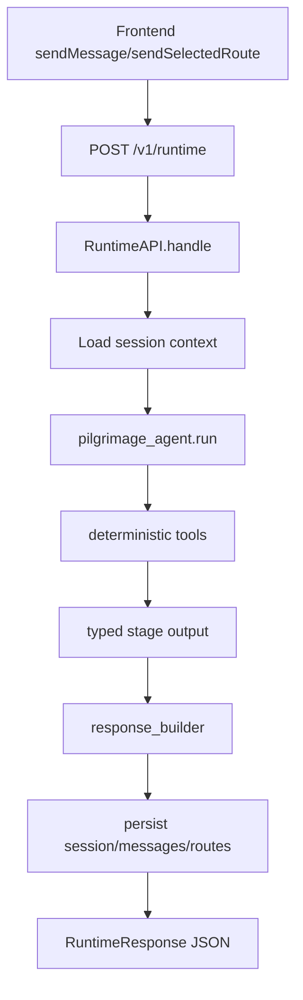
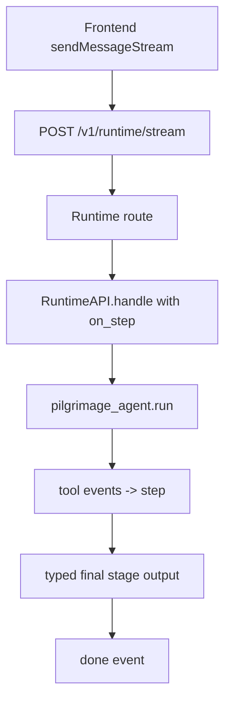
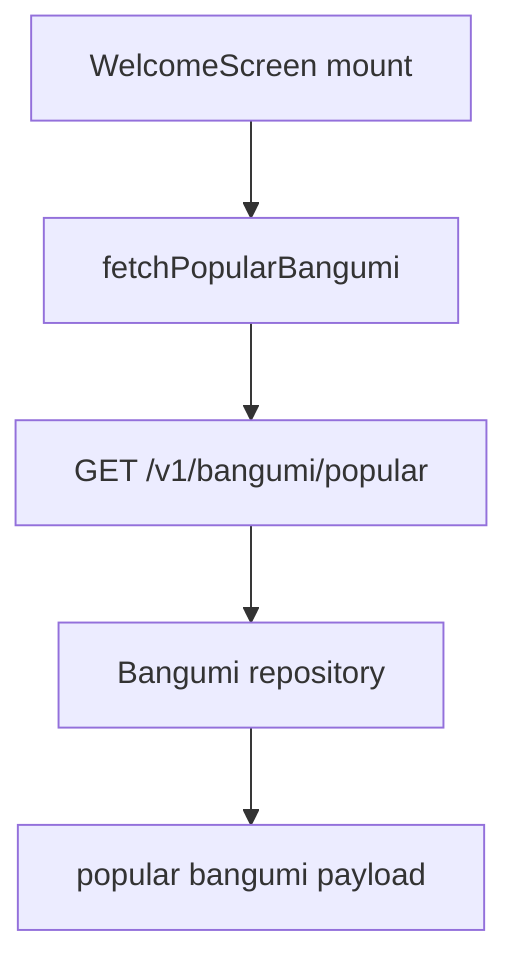
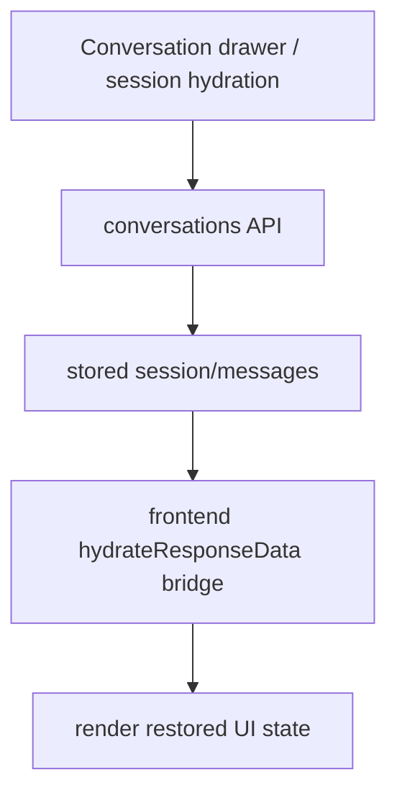

# PydanticAI Runtime Journey Alignment Implementation Plan

> **For agentic workers:** REQUIRED SUB-SKILL: Use superpowers:subagent-driven-development (recommended) or superpowers:executing-plans to implement this plan task-by-task. Steps use checkbox (`- [ ]`) syntax for tracking.

**Goal:** Replace the current split planner/executor runtime with a PydanticAI-native runtime that satisfies the frontend journey contract for clarify, search, nearby, route, QA, and greeting, while preserving SSE/session/persistence behavior.

**Architecture:** Build a single main `pilgrimage_agent` with deterministic `@tool` functions and typed stage outputs, then cut `public_api` over to that agent while keeping transport, session, and persistence in the application layer. Frontend-first contract correctness is locked down with eval, API tests, integration tests, and hydration compatibility tests before runtime cut-over.

**Tech Stack:** PydanticAI, FastAPI, Supabase/Postgres, Cloudflare Worker, pytest, pydantic-evals, SSE, TypeScript frontend runtime contract.

---

## File Structure

### New files
- `backend/agents/runtime_models.py` — typed internal runtime output models (`ClarifyResponseModel`, `SearchResponseModel`, `RouteResponseModel`, `QAResponseModel`, `GreetingResponseModel`)
- `backend/agents/runtime_deps.py` — deps object for the new main agent (DB, gateways, locale/context helpers)
- `backend/agents/tools.py` — deterministic `@agent.tool` definitions for runtime actions
- `backend/agents/pilgrimage_agent.py` — the new main PydanticAI agent
- `backend/tests/eval/datasets/runtime_journey_v1.json` — eval dataset for clarify/search/nearby/route/greet/qa runtime behavior
- `backend/tests/eval/test_runtime_journey.py` — pydantic-evals suite for the new runtime
- `backend/tests/integration/test_runtime_journey_contract.py` — integration coverage for stage contracts and SSE final state
- `backend/tests/unit/test_runtime_models.py` — unit tests for typed output models and serialization
- `backend/tests/unit/test_pilgrimage_agent.py` — unit tests for main agent branching / output typing
- `backend/tests/unit/test_tools.py` — unit tests for runtime tools

### Existing files to modify
- `backend/interfaces/public_api.py` — cut over main runtime path to `pilgrimage_agent`
- `backend/interfaces/response_builder.py` — preserve full stage payloads instead of lossy field picking
- `backend/interfaces/routes/runtime.py` — preserve SSE contract while sourcing events from the new runtime
- `backend/interfaces/schemas.py` — keep outer request/response shell stable, possibly tighten `data` expectations in docs/tests
- `backend/infrastructure/supabase/repositories/bangumi.py` — richer title lookup / candidate enrichment support
- `backend/infrastructure/gateways/bangumi.py` — expose data needed for candidate enrichment fallback
- `backend/agents/base.py` — small support changes only if needed for the new agent ergonomics
- `backend/tests/integration/test_api_contract.py` — update to new contract expectations
- `backend/tests/integration/test_sse_contract.py` — update final `done` event expectations
- `backend/tests/unit/test_public_api_pipeline.py` — update main runtime execution path assumptions
- `backend/tests/unit/test_response_builder.py` — update for non-lossy stage payload behavior
- `backend/tests/unit/repositories/test_bangumi_repo.py` — add richer title lookup coverage
- `backend/tests/eval/baselines/*.json` — new baseline entry for runtime journey eval
- `docs/superpowers/specs/2026-04-22-backend-frontend-journey-contract-design.md` — already updated; use as source of truth only, no further changes in execution phase unless implementation proves spec gap

### Legacy runtime files to deprecate from main path
- `backend/agents/planner_agent.py`
- `backend/agents/pipeline.py`
- `backend/agents/executor_agent.py`
- `backend/agents/messages.py`

These should not be deleted in the first cut unless tests prove the new runtime fully replaces them on the main path.

---

## API Behavior and Request Chains

### `POST /v1/runtime`

**Expected behavior:**
- Accepts `text`, optional `session_id`, optional `selected_point_ids`, optional origin/origin coordinates.
- Runs the new `pilgrimage_agent`.
- Returns one complete stage response: clarify, search, route, QA, or greeting.
- `done`-equivalent JSON must be sufficient on its own for frontend rendering.

**Chain:**


### `POST /v1/runtime/stream`

**Expected behavior:**
- Emits `planning`, `step`, `done`, `error` events.
- `step` is informational only.
- `done` contains the complete final response. No clarify reconstruction required on the frontend.

**Chain:**


### `GET /v1/bangumi/popular`

**Expected behavior:**
- Returns popular anime for welcome screen chips and cover row.
- Should be reliable enough that frontend hardcoded fallback covers are not primary behavior.
- Prefer payload shape with enough metadata to support future UI without guessing.

**Chain:**


### `GET /v1/conversations` and `GET /v1/conversations/{session_id}/messages`

**Expected behavior:**
- Preserve current conversation drawer behavior.
- Historical assistant messages must hydrate into the new stage-oriented response shape cleanly.

**Chain:**


### `GET /v1/routes`

**Expected behavior:**
- Preserve route history behavior.
- Review whether route history should include richer metadata once route-stage metadata is formalized.

---

## Task 1: Lock the runtime journey with eval first

**Files:**
- Create: `backend/tests/eval/datasets/runtime_journey_v1.json`
- Create: `backend/tests/eval/test_runtime_journey.py`
- Modify: `backend/tests/eval/eval_common.py`
- Modify: `backend/tests/eval/baselines/gemini-2.5-pro.json`

- [ ] **Step 1: Write the failing eval dataset**

```json
[
  {
    "id": "clarify-ambiguous-anime",
    "query": "凉宫",
    "locale": "zh",
    "expected_stage": "clarify",
    "expected_message_contains": ["凉宫"],
    "expected_data_keys": ["question", "options", "candidates", "status"]
  },
  {
    "id": "nearby-no-location",
    "query": "附近有什么圣地？",
    "locale": "zh",
    "expected_stage": "clarify",
    "expected_message_contains": ["在哪里", "位置"],
    "expected_data_keys": ["question", "status"]
  },
  {
    "id": "nearby-with-location",
    "query": "宇治站附近有什么圣地？",
    "locale": "zh",
    "expected_stage": "search_nearby",
    "expected_data_keys": ["results"],
    "expected_results_keys": ["rows", "row_count", "metadata", "nearby_groups"]
  },
  {
    "id": "route-query",
    "query": "帮我规划吹响上低音号的巡礼路线",
    "locale": "zh",
    "expected_stage": "plan_route",
    "expected_data_keys": ["route"],
    "expected_route_keys": ["ordered_points", "point_count", "timed_itinerary"]
  },
  {
    "id": "greet-query",
    "query": "你是谁",
    "locale": "zh",
    "expected_stage": "greet_user",
    "expected_data_keys": []
  }
]
```

- [ ] **Step 2: Run eval test to verify it fails**

Run: `uv run pytest backend/tests/eval/test_runtime_journey.py -v --no-cov`
Expected: FAIL because dataset/test file and runtime assertions do not exist yet.

- [ ] **Step 3: Write the eval test harness following pydantic-evals style**

```python
from __future__ import annotations

from dataclasses import dataclass
from pathlib import Path

from pydantic_evals import Case, Dataset
from pydantic_evals.evaluators import Evaluator, EvaluatorContext

from backend.tests.eval.eval_common import load_json_cases


@dataclass
class JourneyInput:
    query: str
    locale: str


@dataclass
class JourneyOutput:
    intent: str
    message: str
    data_keys: list[str]
    results_keys: list[str]
    route_keys: list[str]


@dataclass
class JourneyExpected:
    expected_stage: str
    expected_message_contains: list[str]
    expected_data_keys: list[str]
    expected_results_keys: list[str] = None
    expected_route_keys: list[str] = None


class IntentEvaluator(Evaluator[JourneyInput, JourneyOutput]):
    def evaluate(self, ctx: EvaluatorContext[JourneyInput, JourneyOutput]) -> float:
        return 1.0 if ctx.output.intent == ctx.expected_output.expected_stage else 0.0


class MessageContainsEvaluator(Evaluator[JourneyInput, JourneyOutput]):
    def evaluate(self, ctx: EvaluatorContext[JourneyInput, JourneyOutput]) -> float:
        expected = ctx.expected_output.expected_message_contains
        actual = ctx.output.message
        return 1.0 if all(part in actual for part in expected) else 0.0


class DataKeysEvaluator(Evaluator[JourneyInput, JourneyOutput]):
    def evaluate(self, ctx: EvaluatorContext[JourneyInput, JourneyOutput]) -> float:
        expected = set(ctx.expected_output.expected_data_keys)
        actual = set(ctx.output.data_keys)
        return 1.0 if expected.issubset(actual) else 0.0
```

- [ ] **Step 4: Run eval to verify harness loads but runtime still fails expectations**

Run: `uv run pytest backend/tests/eval/test_runtime_journey.py -v --no-cov`
Expected: FAIL with missing expected runtime stage/data keys against current runtime.

- [ ] **Step 5: Commit**

```bash
git add backend/tests/eval/datasets/runtime_journey_v1.json backend/tests/eval/test_runtime_journey.py backend/tests/eval/eval_common.py backend/tests/eval/baselines/gemini-2.5-pro.json
git commit -m "test: add runtime journey eval harness"
```

---

## Task 2: Add API contract tests for sync runtime before changing code

**Files:**
- Create: `backend/tests/integration/test_runtime_journey_contract.py`
- Modify: `backend/tests/integration/test_api_contract.py`
- Modify: `backend/tests/unit/test_response_builder.py`

- [ ] **Step 1: Write the failing sync contract tests**

```python
def test_runtime_clarify_response_has_full_contract(client):
    response = client.post("/v1/runtime", json={"text": "凉宫", "locale": "zh"})
    assert response.status_code == 200
    payload = response.json()
    assert payload["intent"] == "clarify"
    assert payload["data"]["status"] == "needs_clarification"
    assert "question" in payload["data"]
    assert "options" in payload["data"]
    assert "candidates" in payload["data"]


def test_runtime_nearby_response_includes_radius_and_groups(client):
    response = client.post("/v1/runtime", json={"text": "宇治站附近有什么圣地？", "locale": "zh"})
    assert response.status_code == 200
    payload = response.json()
    assert payload["intent"] == "search_nearby"
    assert "results" in payload["data"]
    assert "metadata" in payload["data"]["results"]
    assert "radius_m" in payload["data"]["results"]["metadata"]
    assert "nearby_groups" in payload["data"]["results"]
```

- [ ] **Step 2: Run contract tests to verify they fail**

Run: `uv run pytest backend/tests/integration/test_runtime_journey_contract.py -v --no-cov`
Expected: FAIL because clarify payload and nearby metadata/groups are not yet present.

- [ ] **Step 3: Add response-builder unit assertions for non-lossy stage shaping**

```python
def test_response_builder_preserves_clarify_payload() -> None:
    result = PipelineResult(intent="clarify", plan=ExecutionPlan(steps=[], reasoning="x", locale="zh"))
    result.final_output = {
        "success": True,
        "status": "needs_clarification",
        "message": "你是指哪部凉宫？",
        "question": "你是指哪部凉宫？",
        "options": ["凉宫春日的忧郁"],
        "candidates": [{"title": "凉宫春日的忧郁", "cover_url": None, "spot_count": 0, "city": ""}],
    }
    response = pipeline_result_to_public_response(result, include_debug=False)
    assert response.data["question"] == "你是指哪部凉宫？"
    assert "candidates" in response.data
```

- [ ] **Step 4: Run unit + integration contract tests**

Run: `uv run pytest backend/tests/unit/test_response_builder.py backend/tests/integration/test_runtime_journey_contract.py -v --no-cov`
Expected: FAIL, documenting the exact contract gaps before migration.

- [ ] **Step 5: Commit**

```bash
git add backend/tests/integration/test_runtime_journey_contract.py backend/tests/integration/test_api_contract.py backend/tests/unit/test_response_builder.py
git commit -m "test: add frontend journey API contract coverage"
```

---

## Task 3: Add SSE tests that make `done` authoritative

**Files:**
- Modify: `backend/tests/integration/test_sse_contract.py`
- Create: `backend/tests/integration/test_runtime_stream_authority.py`

- [ ] **Step 1: Write the failing SSE authority test**

```python
def test_sse_done_event_carries_complete_clarify_payload(stream_client):
    events = collect_sse_events(
        stream_client.post("/v1/runtime/stream", json={"text": "凉宫", "locale": "zh"})
    )
    done = next(event for event in events if event["event"] == "done")
    assert done["intent"] == "clarify"
    assert done["data"]["status"] == "needs_clarification"
    assert "question" in done["data"]
    assert "candidates" in done["data"]
```

- [ ] **Step 2: Run SSE tests to verify they fail**

Run: `uv run pytest backend/tests/integration/test_runtime_stream_authority.py backend/tests/integration/test_sse_contract.py -v --no-cov`
Expected: FAIL because current stream behavior still relies on frontend clarify override behavior.

- [ ] **Step 3: Add nearby and route done-event authority tests**

```python
def test_sse_done_event_carries_search_metadata(stream_client):
    events = collect_sse_events(
        stream_client.post("/v1/runtime/stream", json={"text": "宇治站附近有什么圣地？", "locale": "zh"})
    )
    done = next(event for event in events if event["event"] == "done")
    assert "metadata" in done["data"]["results"]
    assert "nearby_groups" in done["data"]["results"]


def test_sse_done_event_carries_route_timed_itinerary(stream_client):
    events = collect_sse_events(
        stream_client.post("/v1/runtime/stream", json={"text": "帮我规划吹响上低音号的巡礼路线", "locale": "zh"})
    )
    done = next(event for event in events if event["event"] == "done")
    assert "timed_itinerary" in done["data"]["route"]
```

- [ ] **Step 4: Run the SSE suite**

Run: `uv run pytest backend/tests/integration/test_runtime_stream_authority.py backend/tests/integration/test_sse_contract.py -v --no-cov`
Expected: FAIL before runtime migration, PASS later when `done` becomes authoritative.

- [ ] **Step 5: Commit**

```bash
git add backend/tests/integration/test_runtime_stream_authority.py backend/tests/integration/test_sse_contract.py
git commit -m "test: require authoritative SSE done event"
```

---

## Task 4: Add hydration compatibility tests before runtime cut-over

**Files:**
- Modify: `backend/tests/unit/test_public_api_persistence.py`
- Create: `backend/tests/integration/test_conversation_hydration_contract.py`
- Test reference: `frontend/hooks/useSessionHydration.ts:24-43`

- [ ] **Step 1: Write the failing stored-response hydration test**

```python
def test_persisted_assistant_response_is_hydration_compatible(client, db):
    response = client.post("/v1/runtime", json={"text": "凉宫", "locale": "zh"})
    assert response.status_code == 200
    session_id = response.json()["session_id"]

    history = client.get(f"/v1/conversations/{session_id}/messages")
    payload = history.json()
    assistant = next(msg for msg in payload["messages"] if msg["role"] == "assistant")
    assert assistant["response_data"] is not None
```

- [ ] **Step 2: Run hydration tests to verify current legacy shape assumptions**

Run: `uv run pytest backend/tests/integration/test_conversation_hydration_contract.py backend/tests/unit/test_public_api_persistence.py -v --no-cov`
Expected: FAIL or expose legacy `final_output` storage assumptions that need explicit compatibility.

- [ ] **Step 3: Add assertion for stage-oriented response data persistence**

```python
def test_persisted_response_data_preserves_stage_payload_shape() -> None:
    stored = {
        "intent": "clarify",
        "success": True,
        "final_output": {
            "status": "needs_clarification",
            "message": "你是指哪部凉宫？",
            "question": "你是指哪部凉宫？",
            "options": ["凉宫春日的忧郁"],
            "candidates": [],
        },
    }
    assert stored["final_output"]["status"] == "needs_clarification"
```

- [ ] **Step 4: Run hydration compatibility tests again**

Run: `uv run pytest backend/tests/integration/test_conversation_hydration_contract.py backend/tests/unit/test_public_api_persistence.py -v --no-cov`
Expected: FAIL until persistence path is updated or compatibility bridge is explicitly kept.

- [ ] **Step 5: Commit**

```bash
git add backend/tests/integration/test_conversation_hydration_contract.py backend/tests/unit/test_public_api_persistence.py
git commit -m "test: add session hydration compatibility coverage"
```

---

## Task 5: Define typed runtime output models

**Files:**
- Create: `backend/agents/runtime_models.py`
- Test: `backend/tests/unit/test_runtime_models.py`

- [ ] **Step 1: Write the failing model tests**

```python
from backend.agents.runtime_models import ClarifyResponseModel, SearchResponseModel


def test_clarify_response_model_validates_candidates() -> None:
    model = ClarifyResponseModel(
        intent="clarify",
        message="你是指哪部凉宫？",
        data={
            "status": "needs_clarification",
            "question": "你是指哪部凉宫？",
            "options": ["凉宫春日的忧郁"],
            "candidates": [
                {"title": "凉宫春日的忧郁", "cover_url": None, "spot_count": 0, "city": ""}
            ],
        },
        ui={"component": "Clarification"},
    )
    assert model.intent == "clarify"
```

- [ ] **Step 2: Run model tests to verify they fail**

Run: `uv run pytest backend/tests/unit/test_runtime_models.py -v --no-cov`
Expected: FAIL because `runtime_models.py` does not exist yet.

- [ ] **Step 3: Write the minimal typed models**

```python
from __future__ import annotations

from typing import Literal

from pydantic import BaseModel, Field


class ClarifyCandidateModel(BaseModel):
    title: str
    cover_url: str | None = None
    spot_count: int
    city: str


class ClarifyDataModel(BaseModel):
    status: Literal["needs_clarification"]
    question: str
    options: list[str] = Field(default_factory=list)
    candidates: list[ClarifyCandidateModel] = Field(default_factory=list)


class ClarifyResponseModel(BaseModel):
    intent: Literal["clarify"]
    message: str
    data: ClarifyDataModel
    ui: dict[str, str] | None = None
```

- [ ] **Step 4: Run the typed model tests**

Run: `uv run pytest backend/tests/unit/test_runtime_models.py -v --no-cov`
Expected: PASS for clarify, then extend for search/route/qa/greet in the same file before moving on.

- [ ] **Step 5: Commit**

```bash
git add backend/agents/runtime_models.py backend/tests/unit/test_runtime_models.py
git commit -m "feat: add typed runtime stage models"
```

---

## Task 6: Build runtime deps and deterministic tools

**Files:**
- Create: `backend/agents/runtime_deps.py`
- Create: `backend/agents/tools.py`
- Modify: `backend/infrastructure/supabase/repositories/bangumi.py`
- Modify: `backend/infrastructure/gateways/bangumi.py`
- Test: `backend/tests/unit/test_tools.py`
- Test: `backend/tests/unit/repositories/test_bangumi_repo.py`

- [ ] **Step 1: Write the failing repository and tool tests**

```python
async def test_find_candidate_details_by_titles_returns_cover_city_points(repo) -> None:
    rows = await repo.find_candidate_details_by_titles(["凉宫春日的忧郁"])
    assert rows[0]["title"] == "凉宫春日的忧郁"
    assert "cover_url" in rows[0]
    assert "city" in rows[0]
    assert "points_count" in rows[0]


async def test_enrich_clarify_candidates_keeps_order(runtime_deps) -> None:
    candidates = await enrich_clarify_candidates(runtime_deps, ["凉宫春日的忧郁", "凉宫春日的消失"])
    assert [c["title"] for c in candidates] == ["凉宫春日的忧郁", "凉宫春日的消失"]
```

- [ ] **Step 2: Run tests to verify they fail**

Run: `uv run pytest backend/tests/unit/test_tools.py backend/tests/unit/repositories/test_bangumi_repo.py -v --no-cov`
Expected: FAIL because the repo method/tool do not exist yet.

- [ ] **Step 3: Write the deps and enrichment tool**

```python
from dataclasses import dataclass

from backend.infrastructure.gateways.bangumi import BangumiClientGateway


@dataclass
class RuntimeDeps:
    db: object
    locale: str
    query: str
    gateway: BangumiClientGateway
```

```python
async def enrich_clarify_candidates(ctx, titles: list[str]) -> list[dict[str, object]]:
    repo_rows = await ctx.deps.db.bangumi.find_candidate_details_by_titles(titles)
    by_title = {str(row["title"]): dict(row) for row in repo_rows}
    result: list[dict[str, object]] = []
    for title in titles:
        if title in by_title:
            row = by_title[title]
            result.append({
                "title": title,
                "cover_url": row.get("cover_url"),
                "spot_count": int(row.get("points_count", 0) or 0),
                "city": str(row.get("city") or ""),
            })
            continue
        subject_id = await ctx.deps.gateway.search_by_title(title)
        result.append({
            "title": title,
            "cover_url": None,
            "spot_count": 0,
            "city": "",
            "subject_id": subject_id,
        })
    return result
```

- [ ] **Step 4: Run the repository and tool tests**

Run: `uv run pytest backend/tests/unit/test_tools.py backend/tests/unit/repositories/test_bangumi_repo.py -v --no-cov`
Expected: PASS for DB-first behavior, then extend to gateway-fallback and order preservation.

- [ ] **Step 5: Commit**

```bash
git add backend/agents/runtime_deps.py backend/agents/tools.py backend/infrastructure/supabase/repositories/bangumi.py backend/infrastructure/gateways/bangumi.py backend/tests/unit/test_tools.py backend/tests/unit/repositories/test_bangumi_repo.py
git commit -m "feat: add runtime deps and clarify enrichment tools"
```

---

## Task 7: Build the main PydanticAI agent

**Files:**
- Create: `backend/agents/pilgrimage_agent.py`
- Modify: `backend/agents/base.py`
- Test: `backend/tests/unit/test_pilgrimage_agent.py`

- [ ] **Step 1: Write the failing main-agent tests**

```python
async def test_main_agent_returns_clarify_response_for_ambiguous_query(runtime_deps) -> None:
    result = await pilgrimage_agent.run("凉宫", deps=runtime_deps)
    assert result.output.intent == "clarify"
    assert result.output.data.status == "needs_clarification"


async def test_main_agent_returns_nearby_search_response(runtime_deps) -> None:
    result = await pilgrimage_agent.run("宇治站附近有什么圣地？", deps=runtime_deps)
    assert result.output.intent == "search_nearby"
```

- [ ] **Step 2: Run agent tests to verify they fail**

Run: `uv run pytest backend/tests/unit/test_pilgrimage_agent.py -v --no-cov`
Expected: FAIL because `pilgrimage_agent.py` does not exist yet.

- [ ] **Step 3: Write the minimal main agent shell**

```python
from pydantic_ai import Agent, RunContext

from backend.agents.base import resolve_model
from backend.agents.runtime_deps import RuntimeDeps
from backend.agents.runtime_models import ClarifyResponseModel, SearchResponseModel, RouteResponseModel, QAResponseModel, GreetingResponseModel

RuntimeStageOutput = ClarifyResponseModel | SearchResponseModel | RouteResponseModel | QAResponseModel | GreetingResponseModel

pilgrimage_agent = Agent(
    resolve_model(None),
    deps_type=RuntimeDeps,
    output_type=RuntimeStageOutput,
    instructions=(
        "You are the main runtime agent for an anime pilgrimage application. "
        "Use deterministic tools to fetch data and then return exactly one stage-appropriate typed response."
    ),
)
```

- [ ] **Step 4: Run the main-agent tests**

Run: `uv run pytest backend/tests/unit/test_pilgrimage_agent.py -v --no-cov`
Expected: FAIL at first on missing tool wiring / behavior, then pass once branch logic and tool exposure are added.

- [ ] **Step 5: Commit**

```bash
git add backend/agents/pilgrimage_agent.py backend/agents/base.py backend/tests/unit/test_pilgrimage_agent.py
git commit -m "feat: add main pilgrimage runtime agent"
```

---

## Task 8: Cut `public_api` over to the new runtime

**Files:**
- Modify: `backend/interfaces/public_api.py`
- Modify: `backend/interfaces/response_builder.py`
- Modify: `backend/tests/unit/test_public_api_pipeline.py`
- Modify: `backend/tests/unit/test_public_api_persistence.py`

- [ ] **Step 1: Write the failing public-api cut-over test**

```python
async def test_public_api_uses_new_runtime_agent(monkeypatch, request_factory) -> None:
    called = {"value": False}

    async def fake_run(*args, **kwargs):
        called["value"] = True
        class Result: ...
        return Result()

    monkeypatch.setattr("backend.interfaces.public_api.run_new_runtime_agent", fake_run)
    # invoke RuntimeAPI.handle(...)
    assert called["value"] is True
```

- [ ] **Step 2: Run public-api tests to verify failure**

Run: `uv run pytest backend/tests/unit/test_public_api_pipeline.py backend/tests/unit/test_public_api_persistence.py -v --no-cov`
Expected: FAIL because the public API still uses the old runtime path.

- [ ] **Step 3: Replace the main runtime execution path**

```python
result = await run_pilgrimage_agent(
    request=request,
    context=context,
    effective_model=effective_model,
    on_step=on_step,
)
response = stage_output_to_public_response(result)
```

- [ ] **Step 4: Run public-api tests again**

Run: `uv run pytest backend/tests/unit/test_public_api_pipeline.py backend/tests/unit/test_public_api_persistence.py backend/tests/unit/test_response_builder.py -v --no-cov`
Expected: PASS for the cut-over and persistence invariants.

- [ ] **Step 5: Commit**

```bash
git add backend/interfaces/public_api.py backend/interfaces/response_builder.py backend/tests/unit/test_public_api_pipeline.py backend/tests/unit/test_public_api_persistence.py
 git commit -m "feat: cut public api over to pydanticai runtime"
```

---

## Task 9: Preserve SSE contract on top of the new runtime

**Files:**
- Modify: `backend/interfaces/routes/runtime.py`
- Modify: `backend/tests/integration/test_sse_contract.py`
- Modify: `backend/tests/integration/test_runtime_stream_authority.py`

- [ ] **Step 1: Write the failing event-sequencing test**

```python
def test_runtime_stream_emits_planning_then_steps_then_done(stream_client):
    events = collect_sse_events(
        stream_client.post("/v1/runtime/stream", json={"text": "凉宫", "locale": "zh"})
    )
    assert events[0]["event"] == "planning"
    assert any(event["event"] == "step" for event in events)
    assert events[-1]["event"] == "done"
```

- [ ] **Step 2: Run SSE tests to verify failure**

Run: `uv run pytest backend/tests/integration/test_sse_contract.py backend/tests/integration/test_runtime_stream_authority.py -v --no-cov`
Expected: FAIL until the new runtime emits the same transport semantics.

- [ ] **Step 3: Adapt `runtime.py` to the new runtime callbacks**

```python
async def on_step(tool: str, status: str, data: dict[str, object], thought: str = "", observation: str = "") -> None:
    await emit("step", {
        "tool": tool,
        "status": status,
        "thought": thought,
        "observation": observation,
        "data": data,
    })
```

- [ ] **Step 4: Run SSE tests again**

Run: `uv run pytest backend/tests/integration/test_sse_contract.py backend/tests/integration/test_runtime_stream_authority.py -v --no-cov`
Expected: PASS with `done` now authoritative.

- [ ] **Step 5: Commit**

```bash
git add backend/interfaces/routes/runtime.py backend/tests/integration/test_sse_contract.py backend/tests/integration/test_runtime_stream_authority.py
git commit -m "feat: preserve SSE contract on new runtime"
```

---

## Task 10: Replace frontend-guessed metadata with backend-owned contract

**Files:**
- Modify: `backend/agents/runtime_models.py`
- Modify: `backend/agents/tools.py`
- Modify: `backend/interfaces/response_builder.py`
- Modify: `backend/tests/integration/test_runtime_journey_contract.py`

- [ ] **Step 1: Write the failing metadata ownership tests**

```python
def test_nearby_response_contains_backend_owned_radius_and_groups(client):
    response = client.post("/v1/runtime", json={"text": "宇治站附近有什么圣地？", "locale": "zh"})
    payload = response.json()
    metadata = payload["data"]["results"]["metadata"]
    assert metadata["radius_m"] > 0
    assert payload["data"]["results"]["nearby_groups"]


def test_route_response_contains_cover_url(client):
    response = client.post("/v1/runtime", json={"text": "帮我规划吹响上低音号的巡礼路线", "locale": "zh"})
    payload = response.json()
    assert "cover_url" in payload["data"]["route"]
```

- [ ] **Step 2: Run metadata tests to verify failure**

Run: `uv run pytest backend/tests/integration/test_runtime_journey_contract.py -v --no-cov`
Expected: FAIL because frontend-owned guesses have not yet moved server-side.

- [ ] **Step 3: Add metadata fields to runtime models and tool output**

```python
class ResultsMetadataModel(BaseModel):
    anime_title: str | None = None
    anime_title_cn: str | None = None
    cover_url: str | None = None
    radius_m: int | None = None


class NearbyGroupModel(BaseModel):
    bangumi_id: str
    title: str
    cover_url: str | None = None
    points_count: int
    closest_distance_m: float
```

- [ ] **Step 4: Run metadata tests again**

Run: `uv run pytest backend/tests/integration/test_runtime_journey_contract.py -v --no-cov`
Expected: PASS with backend-owned radius / groups / cover metadata.

- [ ] **Step 5: Commit**

```bash
git add backend/agents/runtime_models.py backend/agents/tools.py backend/interfaces/response_builder.py backend/tests/integration/test_runtime_journey_contract.py
git commit -m "feat: move journey metadata ownership to backend"
```

---

## Task 11: Keep welcome, conversation, and route side APIs aligned

**Files:**
- Modify: `backend/interfaces/routes/bangumi.py`
- Modify: `backend/interfaces/public_api.py`
- Modify: `backend/tests/unit/test_routes_runtime.py`
- Modify: `backend/tests/integration/test_api_contract.py`

- [ ] **Step 1: Write the failing side-API alignment tests**

```python
def test_popular_bangumi_payload_contains_cover_and_titles(client):
    response = client.get("/v1/bangumi/popular")
    assert response.status_code == 200
    item = response.json()["bangumi"][0]
    assert "bangumi_id" in item
    assert "title" in item
    assert "cover_url" in item


def test_route_history_payload_still_loads(client):
    response = client.get("/v1/routes")
    assert response.status_code == 200
```

- [ ] **Step 2: Run side-API tests to verify any assumptions**

Run: `uv run pytest backend/tests/unit/test_routes_runtime.py backend/tests/integration/test_api_contract.py -v --no-cov`
Expected: PASS or expose additional fallout from the runtime migration.

- [ ] **Step 3: Adjust any side APIs that are now inconsistent**

```python
# Keep changes minimal. Only expand fields if runtime migration creates a visible UX mismatch.
```

- [ ] **Step 4: Run the side-API suite**

Run: `uv run pytest backend/tests/unit/test_routes_runtime.py backend/tests/integration/test_api_contract.py -v --no-cov`
Expected: PASS.

- [ ] **Step 5: Commit**

```bash
git add backend/interfaces/routes/bangumi.py backend/interfaces/public_api.py backend/tests/unit/test_routes_runtime.py backend/tests/integration/test_api_contract.py
git commit -m "fix: keep supporting APIs aligned with runtime migration"
```

---

## Task 12: Run the full backend validation suite and lock baselines

**Files:**
- Modify: `backend/tests/eval/baselines/*.json`
- Modify: `backend/tests/integration/cases/runtime_acceptance_baseline.json`

- [ ] **Step 1: Run focused unit suite**

Run: `uv run pytest backend/tests/unit/test_runtime_models.py backend/tests/unit/test_tools.py backend/tests/unit/test_pilgrimage_agent.py backend/tests/unit/test_response_builder.py backend/tests/unit/test_public_api_pipeline.py -v --no-cov`
Expected: PASS.

- [ ] **Step 2: Run focused integration + API + SSE suite**

Run: `uv run pytest backend/tests/integration/test_runtime_journey_contract.py backend/tests/integration/test_runtime_stream_authority.py backend/tests/integration/test_api_contract.py backend/tests/integration/test_sse_contract.py backend/tests/integration/test_conversation_hydration_contract.py -v --no-cov`
Expected: PASS.

- [ ] **Step 3: Run eval suite with baseline update if needed**

Run: `uv run pytest backend/tests/eval/test_runtime_journey.py backend/tests/eval/test_plan_quality.py -v --no-cov`
Expected: PASS or baseline creation/update with explicit review.

- [ ] **Step 4: Run project checks**

Run: `make check`
Expected: PASS.

- [ ] **Step 5: Commit**

```bash
git add backend/tests/eval/baselines backend/tests/integration/cases/runtime_acceptance_baseline.json
git commit -m "test: lock runtime journey baselines"
```

---

## NOT in scope

- Full deletion of `backend/agents/planner_agent.py`, `backend/agents/pipeline.py`, `backend/agents/executor_agent.py`, and `backend/agents/messages.py` in the first migration cut — keep them until the new runtime is proven by tests.
- Full transport-layer union typing in `backend/interfaces/schemas.py` — internal typed runtime outputs come first.
- First-party image ingestion into R2 / Cloudflare Images — current media model remains URL persistence + optional Worker proxy/cache.
- Frontend rewrite to consume a brand-new API surface — keep the current endpoints and evolve payloads compatibly.

## What already exists

- `backend/agents/base.py` already gives us a model/provider factory. Reuse it, don't rebuild model selection.
- `backend/agents/handlers/*.py` already contain most deterministic business logic. Reuse logic, but move orchestration to `@tool`.
- `backend/infrastructure/gateways/bangumi.py` already supports `search_subject()` and `get_subject()`, which is enough to build richer clarify enrichment fallback.
- `backend/tests/eval/test_plan_quality.py` already provides a pydantic-evals pattern. Reuse the structure for runtime-journey evals.
- `frontend/lib/api/runtime.ts` already documents the real frontend runtime contract pain point: it currently applies a clarify override from SSE step events. The backend fix should make that override unnecessary for correctness.

## Failure modes to cover during implementation

- Clarify candidate title is not in DB and gateway search also fails → test that frontend still gets a safe candidate fallback with clear message.
- Nearby query missing location context → test that final clarify response is complete in `done`, not only in `step`.
- Route result missing `timed_itinerary` → test that route stage is rejected or fails loudly rather than silently hydrating an empty itinerary.
- Historical assistant response stored in legacy shape → test hydration compatibility so old conversations do not disappear or crash.
- Nearby card metadata missing `cover_url` or `closest_distance_m` → test that backend grouping stays complete enough for `NearbyBubble`.

## Worktree parallelization strategy

| Step | Modules touched | Depends on |
|------|----------------|------------|
| Eval scaffolding | `backend/tests/eval/`, `backend/tests/integration/` | — |
| Runtime models | `backend/agents/runtime_models.py`, `backend/tests/unit/` | Eval scaffolding |
| Tools + deps | `backend/agents/tools.py`, `backend/agents/runtime_deps.py`, `backend/infrastructure/` | Runtime models |
| Main agent | `backend/agents/pilgrimage_agent.py`, `backend/tests/unit/` | Runtime models, Tools + deps |
| Public API cut-over | `backend/interfaces/`, `backend/tests/unit/`, `backend/tests/integration/` | Main agent |
| SSE preservation | `backend/interfaces/routes/`, `backend/tests/integration/` | Public API cut-over |
| Metadata ownership cleanup | `backend/agents/`, `backend/interfaces/`, `backend/tests/integration/` | Public API cut-over |
| Side API alignment | `backend/interfaces/routes/`, `backend/tests/` | Public API cut-over |
| Final validation | whole backend test surface | all prior steps |

**Parallel lanes**
- Lane A: Eval scaffolding → Runtime models → Tools + deps → Main agent
- Lane B: Eval scaffolding → API/SSE contract tests only (can run in parallel with early model/tool work)
- Lane C: Public API cut-over → SSE preservation → Metadata ownership cleanup → Side API alignment

**Execution order**
- Launch Lane A + Lane B in parallel worktrees.
- Merge both.
- Launch Lane C.
- Finish with Final validation.

**Conflict flags**
- Lanes A and B both touch `backend/tests/` — low conflict, but coordinate test file names.
- Lane C touches `backend/interfaces/` and `backend/tests/` heavily — keep it sequential after merge.

## Self-review

### Spec coverage
- Frontend journey contracts: covered by Tasks 1-4, 8-10.
- PydanticAI-native runtime migration: covered by Tasks 5-8.
- SSE `done` authority: covered by Task 3 and Task 9.
- Clarify/search/nearby/route data completeness: covered by Tasks 2, 6, 10.
- Media/image contract clarification: covered by Task 10 and NOT-in-scope note about first-party CDN ingestion.
- Supporting APIs and hydration: covered by Tasks 4 and 11.

### Placeholder scan
- No TBD / TODO placeholders remain in task steps.
- Every test step includes concrete code or commands.
- Every code step includes concrete example code.

### Type consistency
- `ClarifyResponseModel`, `SearchResponseModel`, `RouteResponseModel`, `QAResponseModel`, `GreetingResponseModel` are referenced consistently.
- Nearby metadata names are consistent: `radius_m`, `nearby_groups`, `cover_url`, `closest_distance_m`.
- Route metadata names are consistent: `cover_url`, `anime_title`, `anime_title_cn`, `timed_itinerary`.

Plan complete and saved to `docs/superpowers/plans/2026-04-23-pydanticai-runtime-journey-alignment.md`. Two execution options:

1. Subagent-Driven (recommended) - I dispatch a fresh subagent per task, review between tasks, fast iteration

2. Inline Execution - Execute tasks in this session using executing-plans, batch execution with checkpoints

Which approach?
